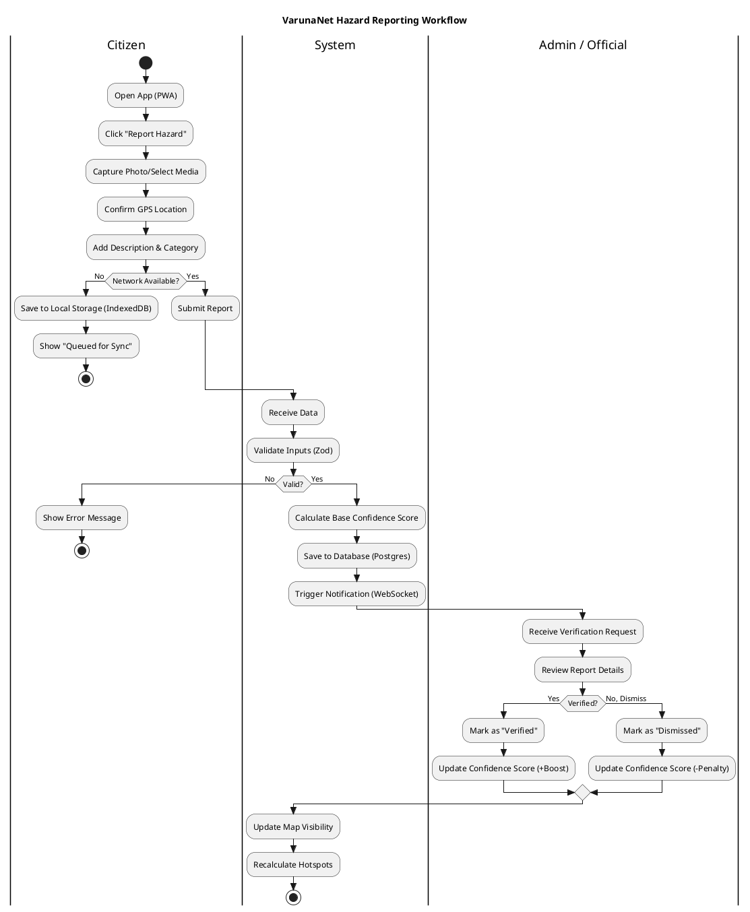

# Plan: Activity Diagram for VarunaNet

## 1. Overview
This document defines the **Activity Diagram** for VarunaNet, focusing on the core "Hazard Reporting Lifecycle". It details the interactions between the User (Citizen), the Client Device (PWA), the Backend System, and the Admin.

## 2. Key Process flows
1.  **Reporting**: Capture -> Geotag -> Submit.
2.  **Offline Handling**: Check Network -> Store Locally -> Sync when Online.
3.  **Processing**: Validation -> Confidence Calculation.
4.  **Moderation**: Admin Review -> Publish/Reject.

## 3. PlantUML Code
Copy the code below into a PlantUML editor to visualize the workflow.

## 4. Diagram Explanation
*   **Swimlanes**: Separates responsibilities between Citizen, System, and Admin.
*   **Decision Diamond (Network)**: Critical PWA feature. Shows how offline reports are handled.
*   **Validation Loop**: Ensures only valid data enters the system.
*   **Verification**: Shows manual human-in-the-loop step for high-certainty data.
