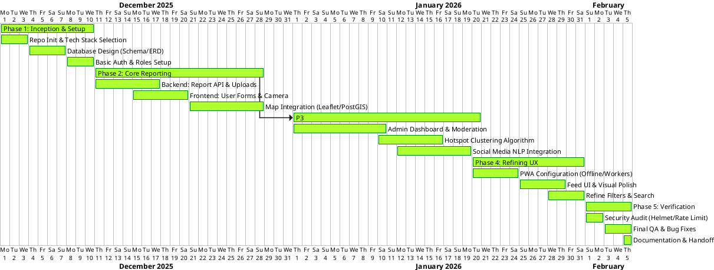

# Project Plan: VarunaNet Timeline (Gantt)

## Goal Description
This document provides a visualization of the project timeline for **VarunaNet** (Crowdsourced Ocean Hazard Platform) from **December 1, 2025** to **February 5, 2026**.

## Gantt Chart (PlantUML)

You can render the chart below using the [PlantUML](https://plantuml.com/gantt-diagram) VS Code extension or any online PlantUML viewer.

## Task Breakdown

### Phase 1: Inception (Dec 1 - Dec 10)
- **Goal:** Establish foundation.
- Tasks:
  - Initialize Node.js/React structure.
  - Define PostgreSQL/PostGIS schema.
  - Implement JWT Authentication.

### Phase 2: Core Development (Dec 11 - Dec 31)
- **Goal:** Enable data collection.
- Tasks:
  - Report submission API (Multipart/form-data).
  - Geometry storage in PostGIS.
  - Interactive Map component.

### Phase 3: Intelligence (Jan 1 - Jan 20)
- **Goal:** Add value to data.
- Tasks:
  - Admin verification queues.
  - `ST_ClusterDBSCAN` for hotspots.
  - Mock/MVP NLP service for social posts.

### Phase 4: Refinement (Jan 21 - Jan 31)
- **Goal:** Improve UX using PWA standards.
- Tasks:
  - Manifest & Service Workers.
  - Responsive visual design.

### Phase 5: Finalization (Feb 1 - Feb 5)
- **Goal:** Production readiness.
- Tasks:
  - Security hardening.
  - Final documentation (ERD, API docs).
