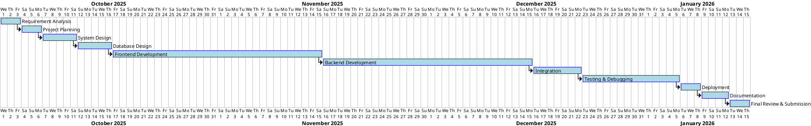

# Project Timeline Plan

## Overview
This document outlines the project schedule based on the SDLC waterfall model.
**Total Duration:** October 1, 2025 – January 15, 2026

## Gantt Chart (PlantUML)

## Task Breakdown

| Phase | Est. Start | Est. Duration |
|-------|------------|---------------|
| Requirement Analysis | Oct 1 | 3 days |
| Project Planning | Oct 4 | 3 days |
| System Design | Oct 7 | 5 days |
| Database Design | Oct 12 | 5 days |
| **Frontend Development** | **Oct 17** | **30 days** |
| **Backend Development** | **Nov 16** | **30 days** |
| Integration | Dec 16 | 7 days |
| Testing & Debugging | Dec 23 | 14 days |
| Deployment | Jan 6 | 3 days |
| Documentation | Jan 9 | 4 days |
| Final Review | Jan 13 | 3 days |
