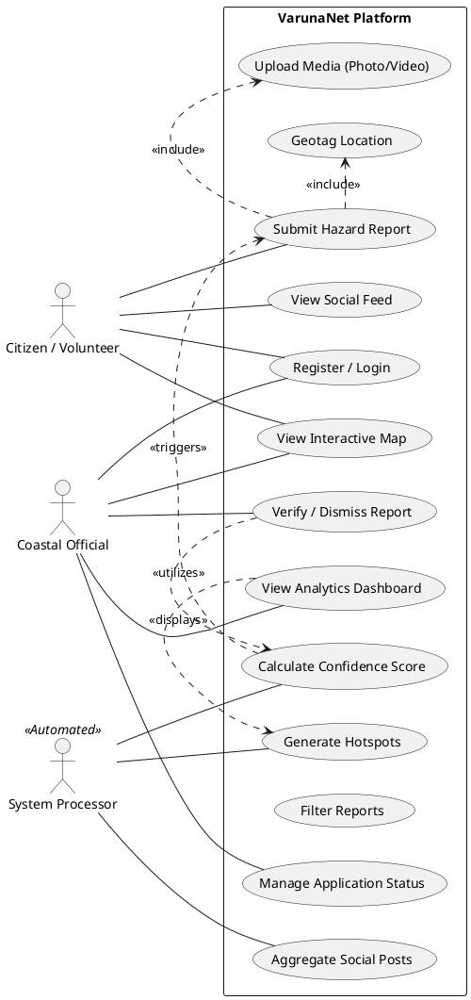

# Plan: Use Case Diagram for VarunaNet

## 1. Overview
This document defines the **Use Case Diagram** for VarunaNet, illustrating the functional requirements and interactions between external entities (Actors) and the system.

## 2. Actors
*   **Citizen / Volunteer**: Primary data contributor. Can report hazards and view the map.
*   **Coastal Official (Admin)**: Moderator. Verifies reports and views analytics.
*   **System (Automated)**: Background processes. Handles confidence scoring and social media aggregation.

## 3. PlantUML Code
Copy the code below into a PlantUML editor (or use a VS Code extension) to visualize the diagram.

## 4. Key Use Case Descriptions

### UC2: Submit Hazard Report
*   **Actor**: Citizen
*   **Flow**: User captures photo -> Confirms Location -> Adds Description -> Submits.
*   **System Action**: Stores report, triggers Confidence Score calculation (UC10).

### UC8: Verify Report
*   **Actor**: Official
*   **Flow**: Admin views "Pending" reports -> Reviews evidence -> Marks as "Verified" or "Dismissed".
*   **Result**: Updates report status and visibility on the public map.

### UC11: Aggregate Social Posts
*   **Actor**: System Processor
*   **Flow**: Scheduled job fetches tweets/posts with relevant hashtags -> Runs NLP -> Stores as potential hazards.
